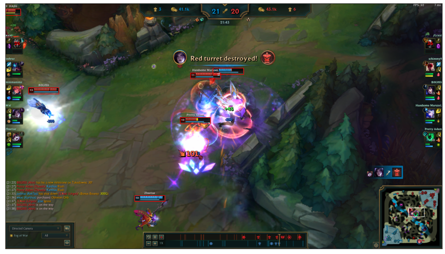

# lol_challenge
This is a script made for esportsLABgg League Vision Challenge. 
Main task was to write a script which takes screenshot from League of Legends and prints out number of visible healthbars belonging to champions only. Only Python language was accepted. For more details go to pdf.

My program uses mainly cv2 edge detection algorithm to detect spaces where healthbars could be. Then I iterate over those spaces to find healthbar matches within given threshold. This solution is not ideal though. There are some cases where bars are hidden behind other bars or some game messages and algorithm doesn't notice them. There is certainly room for improvement.

## Installation
To install simply clone github repository with:
```
git clone https://github.com/franul/lol_challenge.git
```
To run program go to repository location, install required packages with:
```
pip install -r requirements.txt
```
and run program with:
```
python run.py test_data/screen1.jpg
```

Here you can see an example image with indicated health bars (code can be found in jupyter notebook):
<p align="center">
  
</p>
